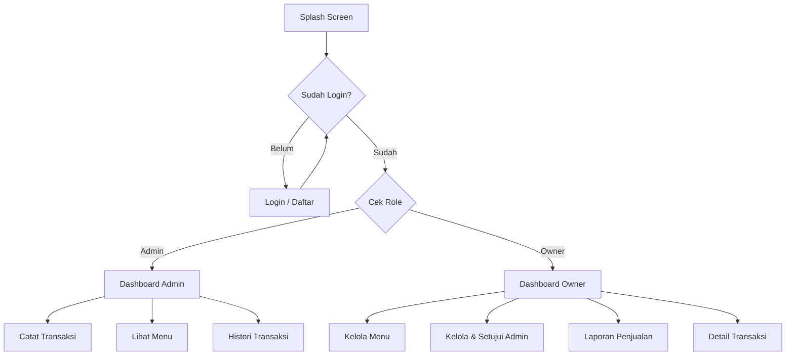

# 🥣 Kasir BaksoKita - Sistem Manajemen Kasir Digital

[](https://flutter.dev)
[](https://firebase.google.com)

**Kasir BaksoKita** adalah solusi digital modern untuk manajemen operasional warung bakso. Aplikasi ini dirancang untuk memudahkan pencatatan transaksi, pengelolaan stok menu, hingga pelaporan keuangan secara real-time menggunakan ekosistem Firebase.

---

## 🚀 Fitur Utama

- **Multi-Role Access**: Pemisahan hak akses antara **Owner** (Pemilik) dan **Admin** (Kasir).
- **Manajemen Menu**: Kelola item menu (tambah, edit, hapus) dengan mudah oleh Owner.
- **Transaksi Cepat**: Input pesanan pelanggan dengan antarmuka yang intuitif.
- **Laporan Penjualan**: Visualisasi data transaksi dan laporan pendapatan periodik.
- **Persetujuan Admin**: Fitur keamanan bagi Owner untuk menyetujui pendaftaran admin baru.
- **Dark Mode Support**: Tema aplikasi yang dapat beralih antara mode terang dan gelap.

---

## 🔄 Alur Aplikasi (Flow)



1. **Autentikasi**: Pengguna masuk menggunakan email. Jika belum punya akun, pengguna dapat mendaftar.
2. **Dashboard**: 
   - **Admin** fokus pada operasional harian (pencatatan transaksi).
   - **Owner** fokus pada manajerial (stok menu, laporan, dan verifikasi staf).
3. **Transaksi**: Admin memasukkan pesanan -> Data tersimpan di Firebase Firestore -> Stok/Laporan terupdate otomatis.
4. **Laporan**: Owner memantau performa penjualan melalui ringkasan data yang ditarik langsung dari database.

---

## 🛠️ Panduan Setup (Installation Guide)

Ikuti langkah-langkah berikut untuk menjalankan project ini di lingkungan lokal Anda:

### 1. Prasyarat (Prerequisites)
Pastikan Anda sudah menginstall:
- [Flutter SDK](https://docs.flutter.dev/get-started/install) (Versi terbaru direkomendasikan)
- [Dart SDK](https://dart.dev/get-started/sdk)
- Java Development Kit (JDK)
- Android Studio / VS Code dengan plugin Flutter & Dart

### 2. Kloning Project
```bash
git clone https://github.com/username/kasir_bakso.git
cd kasir_bakso
```

### 3. Install Dependencies
```bash
flutter pub get
```

### 4. Konfigurasi Firebase
Demi keamanan, file konfigurasi Firebase asli di-ignore oleh Git. Anda perlu menyiapkan project Firebase sendiri:

1. Buat project baru di [Firebase Console](https://console.firebase.google.com/).
2. Aktifkan **Authentication** (Email/Password) dan **Cloud Firestore**.
3. Daftarkan aplikasi Android/iOS Anda di Firebase.
4. Unduh file konfigurasi dan letakkan di:
   - **Android**: `android/app/google-services.json`
   - **iOS**: `ios/Runner/GoogleService-Info.plist`
5. **Penting**: Kami menyediakan file contoh. Anda bisa menyalinnya:
   ```bash
   # Untuk Firebase Options (Dart)
   cp lib/firebase_options.example.dart lib/firebase_options.dart
   ```
   Lalu lengkapi `lib/firebase_options.dart` dengan API Key dan App ID project Anda.

### 5. Jalankan Aplikasi
Hubungkan perangkat (Emulator/Physical Device) lalu jalankan:
```bash
flutter run
```

---

## 📁 Struktur Direktori Penting
- `lib/core`: Logika bisnis, routing, tema, dan layanan database.
- `lib/tampilan`: Kumpulan UI/Widget yang dibagi per modul (Admin, Owner, Auth).
- `assets`: Gambar dan icon aplikasi.

---

## 📄 Lisensi
Project ini dibuat untuk keperluan manajemen internal dan bersifat *open-source* untuk pembelajaran.

---
